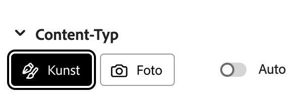
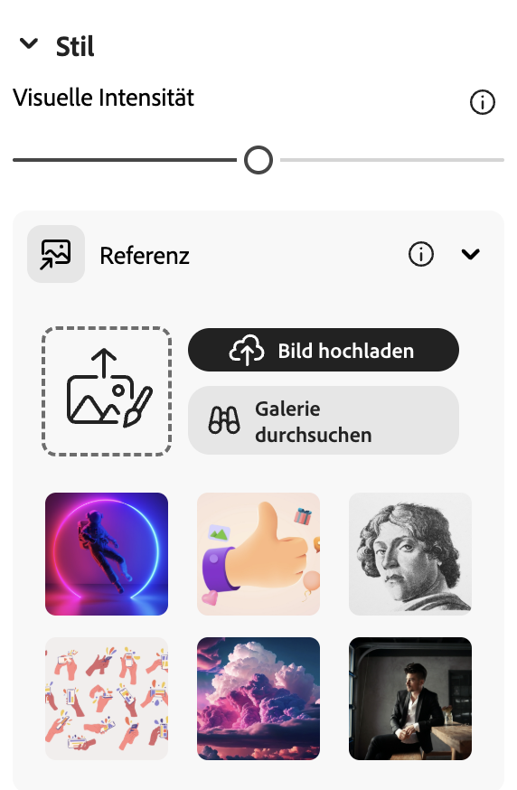
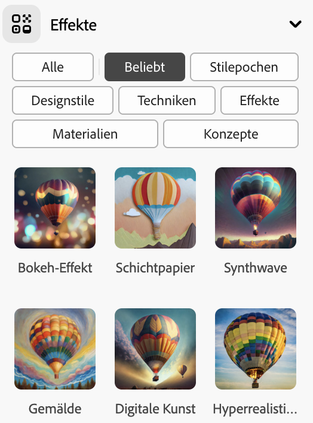
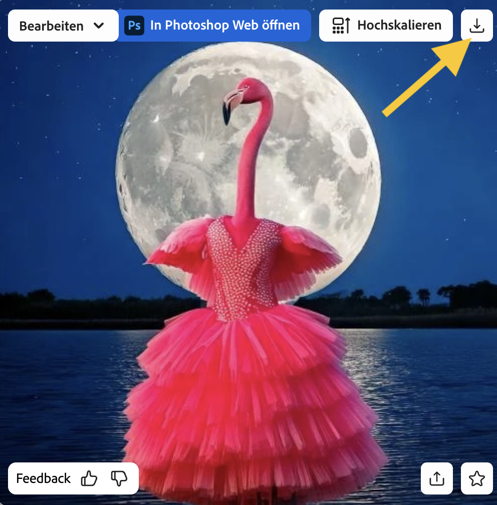

## Stile und Effekte

<html>
  

    <iframe style="position: absolute; top: 0; left: 0; right: 0; width: 100%; height: 100%; border: none;" src="https://www.youtube.com/embed/AXQFcthUIMY?rel=0&cc_load_policy=1" allowfullscreen allow="accelerometer; autoplay; clipboard-write; encrypted-media; gyroscope; picture-in-picture; web-share"></iframe>
  

</html>

Außer dem Hinzufügen weiterer Information zu deinem Prompt, kannst du außerdem die Einstellungen verwenden, um dem KI-Modell mehr Information darüber zu geben, wie das fertige Bild aussehen soll.

### Inhaltstyp (Content type)

Wähle aus, ob der Bildstil ein Kunstwerk oder ein Foto ist.

### Stile

Wähle den gewünschten Bildstil aus. Du kannst auch ein Bild hochladen und das KI-Modell bitten, den Stil zu kopieren.

### Effekte

Wähle alle Effekte aus, die du auf dein Bild anwenden möchtest. Du kannst es beispielsweise wie einen Teil eines Comicbuchs aussehen lassen, oder so, als wäre es mit Kohle gezeichnet.

\--- task ---

Experimentiere mit verschiedenen Inhaltstypen, Stilen und Effekten, bis du mit dem Bild zufrieden sind, das das KI-Modell erzeugt hat.

\--- /task ---

\--- task ---

Speichere dein Bild. Klicke darauf und anschließend oben rechts auf die Schaltfläche **Herunterladen**.

\--- /task ---
