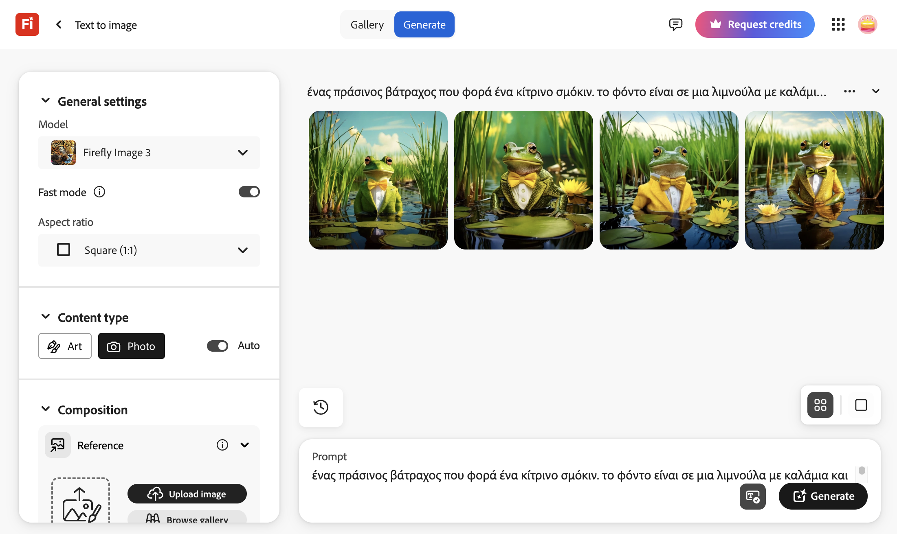

## Τι θα φτιάξεις

Πληκτρολόγησε μια περιγραφή για μια εικόνα και παρακολούθησε πώς η τεχνητή νοημοσύνη ζωντανεύει τη δημιουργία σου.

Αυτό το έργο χρησιμοποιεί [Adobe Firefly](https://firefly.adobe.com/){:target="_blank"}, το οποίο απαιτεί ένα Adobe ID. Πρέπει να είσαι πάνω από 13 για να εγγραφείς για ένα ατομικό Adobe ID.

--- collapse ---
---
title: Υπάρχει στο YouTube; Κάνε λήψη των βίντεο!
---

Μπορείς να κατεβάσεις όλα τα βίντεο γι' αυτό το έργο, συμπεριλαμβανομένου του παραπάνω βίντεο [κάνοντας κλικ εδώ](https://rpf.io/p/el-GR/ai-image-go){:target="_blank"}.

--- /collapse ---
