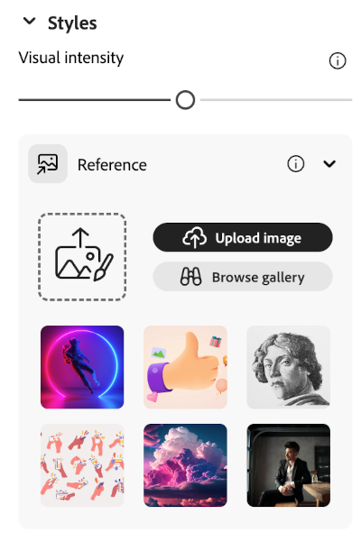
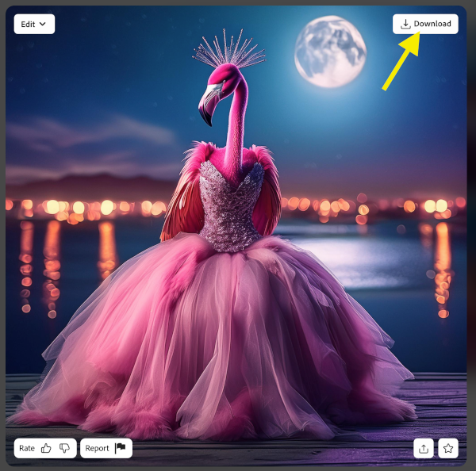

## Στυλ και εφέ

<html>
  

    <iframe style="position: absolute; top: 0; left: 0; right: 0; width: 100%; height: 100%; border: none;" src="https://www.youtube.com/embed/AXQFcthUIMY?rel=0&cc_load_policy=1" allowfullscreen allow="accelerometer; autoplay; clipboard-write; encrypted-media; gyroscope; picture-in-picture; web-share"></iframe>
  

</html>

Εκτός από την προσθήκη περισσότερων πληροφοριών στην προτροπή σου, μπορείς να χρησιμοποιήσεις τις ρυθμίσεις για να δώσεις στο μοντέλο AI περισσότερες πληροφορίες σχετικά με το πώς θα ήθελες να φαίνεται η τελική εικόνα σου.

### Τύπος περιεχομένων
Επίλεξε εάν το στυλ εικόνας είναι έργο τέχνης ή φωτογραφία.

### Styles
Επίλεξε το στυλ της εικόνας που θέλεις. Μπορείς ακόμη να ανεβάσεις μια εικόνα και να ζητήσεις από το μοντέλο AI να αντιγράψει το στυλ.

### Effects
Επίλεξε τα εφέ που θέλεις να εφαρμόσεις στην εικόνα σου. Για παράδειγμα, μπορείς να το κάνεις να μοιάζει με μέρος ενός κόμικ ή σαν να σχεδιάστηκε με κάρβουνο.

--- task ---

Πειραματίσου με διαφορετικούς τύπους περιεχομένου, στυλ και εφέ μέχρι να είσαι ευχαριστημένος/η με την εικόνα που έχει δημιουργήσει το μοντέλο AI.

--- /task ---

--- task ---

Αποθήκευσε την εικόνα σου. Κάνε κλικ σε αυτό και, στη συνέχεια, κάνε κλικ στο κουμπί **Download** επάνω δεξιά.

--- /task ---
