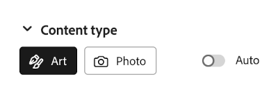
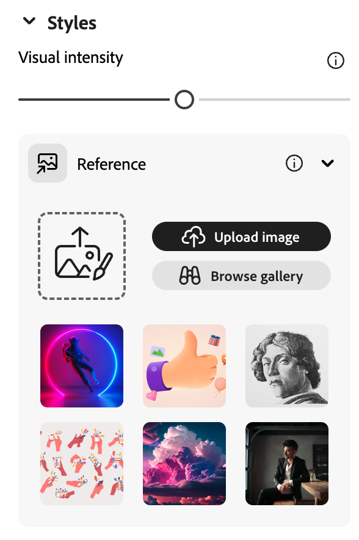
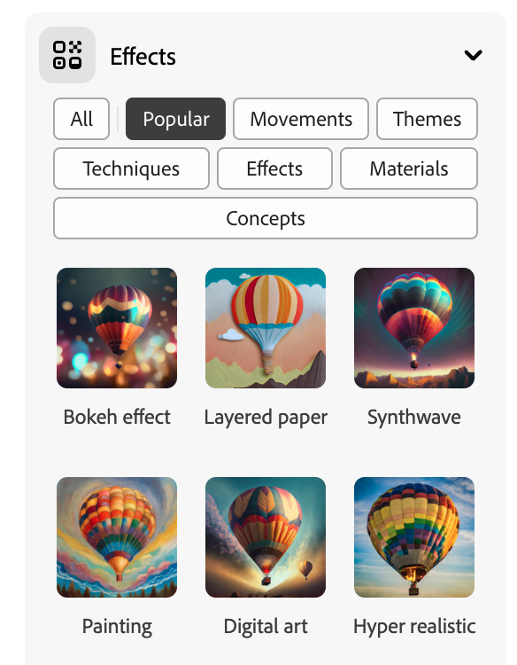

## Styles and effects

<html>
  

    <iframe style="position: absolute; top: 0; left: 0; right: 0; width: 100%; height: 100%; border: none;" src="https://www.youtube.com/embed/AXQFcthUIMY?rel=0&cc_load_policy=1" allowfullscreen allow="accelerometer; autoplay; clipboard-write; encrypted-media; gyroscope; picture-in-picture; web-share"></iframe>
  

</html>

As well as adding more information into your prompt, you can use the settings to give the AI model more information about how you would like your finished image to look. 

### Content type
Select whether the image style is an artwork or photograph.

### Styles
Select the style of image you want. You can even upload an image and ask the AI model to copy the style.

### Effects
Select any effects you want to apply to your image. For example, you can make it look like part of a comic book, or like it was drawn with charcoal. 

--- task ---

Experiment with different content types, styles, and effects until you are happy with the image that the AI model has generated.

--- /task ---

--- task ---

Save your image. Click on it and then click on the **Download** button on the top right.

--- /task ---
