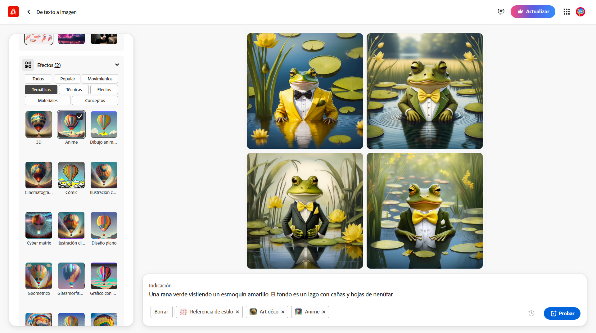

## Lo que harás

Introduce la descripción de una imagen y observa cómo la IA da vida a tu creación.

Este proyecto usa [Adobe Firefly](https://firefly.adobe.com/){:target="_blank"}, que requiere una cuenta de Adobe. Tienes que tener 13 años o más para crear una cuenta individual de Adobe.

--- collapse ---
---
title: ¿No tienes YouTube? ¡Descarga los vídeos!
---

Puedes descargar todos los vídeos de este proyecto, incluido el vídeo de arriba, [pinchando aquí](https://rpf.io/p/es-LA/ai-image-go){:target="_blank"}.

--- /collapse ---