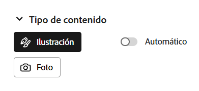
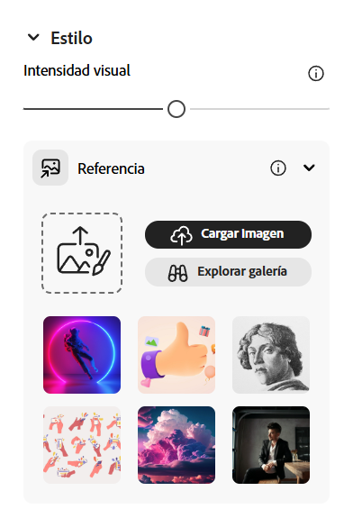
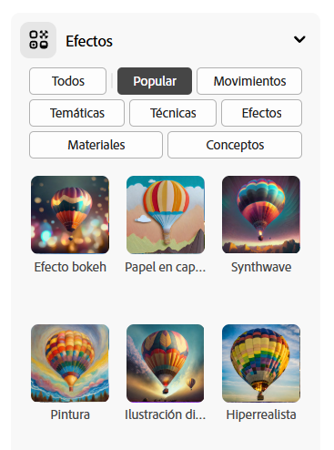
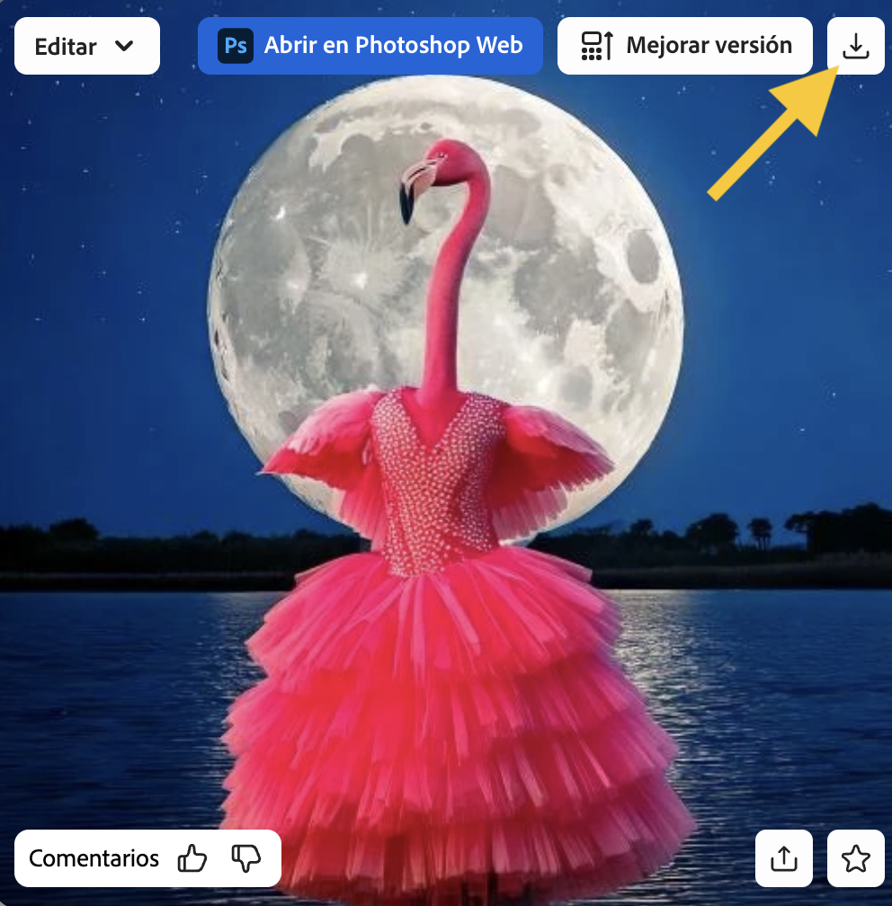

## Estilos y efectos

<html>
  

    <iframe style="position: absolute; top: 0; left: 0; right: 0; width: 100%; height: 100%; border: none;" src="https://www.youtube.com/embed/AXQFcthUIMY?rel=0&cc_load_policy=1" allowfullscreen allow="accelerometer; autoplay; clipboard-write; encrypted-media; gyroscope; picture-in-picture; web-share"></iframe>
  

</html>

Además de añadir más información a tu instrucción, puedes usar la configuración para darle a la IA más información acerca de cómo quieres que se vea tu imagen.

### Tipo de contenido

Selecciona si la imagen es una ilustración o una foto.

### Estilo

Selecciona el estilo de imagen que quieres. Incluso puedes subir una imagen y pedirle a la IA que copie el estilo.

### Efectos

Selecciona los efectos que quieras aplicar a tu imagen. Por ejemplo, puedes hacer que parezca un cómic, o como si estuviera dibujado con carboncillo.

\--- task ---

Experimenta con diferentes tipos de contenido, estilos y efectos hasta que estés contento con la imagen que la IA ha generado.

\--- /task ---

\--- task ---

Guarda tu imagen. Pincha en ella y luego pincha **Descargar** en la esquina de arriba a la derecha.

\--- /task ---
