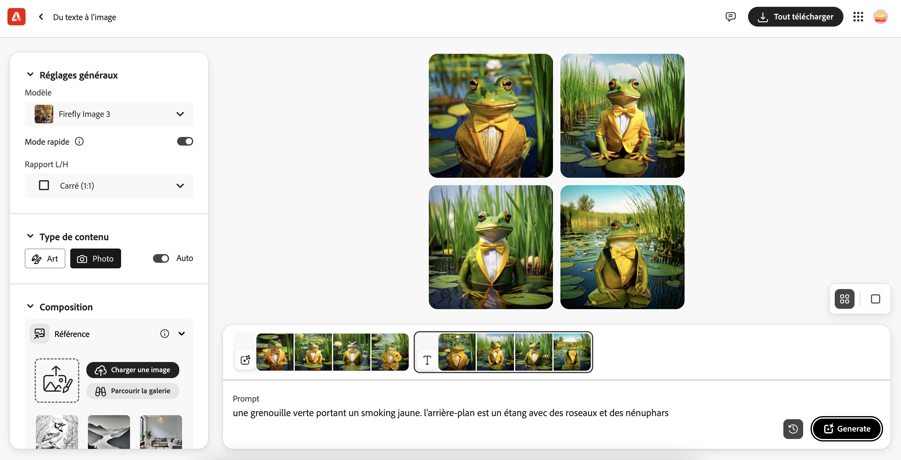

## Ce que tu vas faire

Saisis la description d'une image et observe l'IA donner vie à ta création.

Ce projet utilise [Adobe Firefly](https://firefly.adobe.com/){:target="_blank"}, qui nécessite un Adobe ID. Tu dois avoir 13 ans ou plus pour créer un Adobe ID individuel.

## --- collapse ---

## title: Pas de YouTube ? Télécharge les vidéos !

Tu peux télécharger toutes les vidéos de ce projet, y compris la vidéo ci-dessus [en cliquant ici](https://rpf.io/p/en/ai-image-go){:target="_blank"}.

\--- /collapse ---
