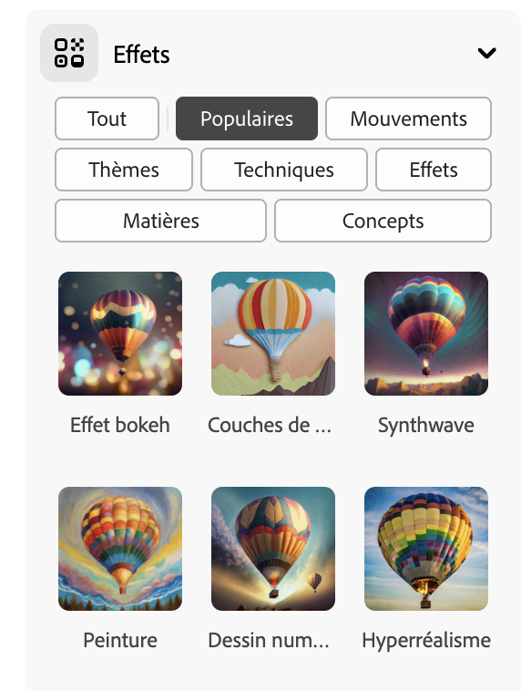

## Styles et effets

<html>
  

    <iframe style="position: absolute; top: 0; left: 0; right: 0; width: 100%; height: 100%; border: none;" src="https://www.youtube.com/embed/AXQFcthUIMY?rel=0&cc_load_policy=1" allowfullscreen allow="accelerometer; autoplay; clipboard-write; encrypted-media; gyroscope; picture-in-picture; web-share"></iframe>
  

</html>

En plus d'ajouter plus d'informations à ton prompt, tu peux utiliser les paramètres pour donner au modèle IA plus d'informations sur l'apparence que tu souhaites donner à ton image finale.

### Type de contenu

Sélectionne si le style d’image est une œuvre d’art ou une photographie.

### Styles

Sélectionne le style d'image que tu souhaites. Tu peux même charger une image et demander au modèle IA de copier le style.

### Effets

Sélectionne les effets que tu souhaites appliquer à ton image. Par exemple, tu peux donner l'impression qu'elle fait partie d'une bande dessinée ou qu'elle a été dessinée au fusain.

--- task ---

Expérimente différents types de contenu, de styles et d'effets jusqu'à ce que tu sois satisfait de l'image générée par le modèle IA.

--- /task ---

--- task ---

Enregistre tes images. Clique dessus puis clique sur le bouton **Télécharger** en haut à droite.

--- /task ---
