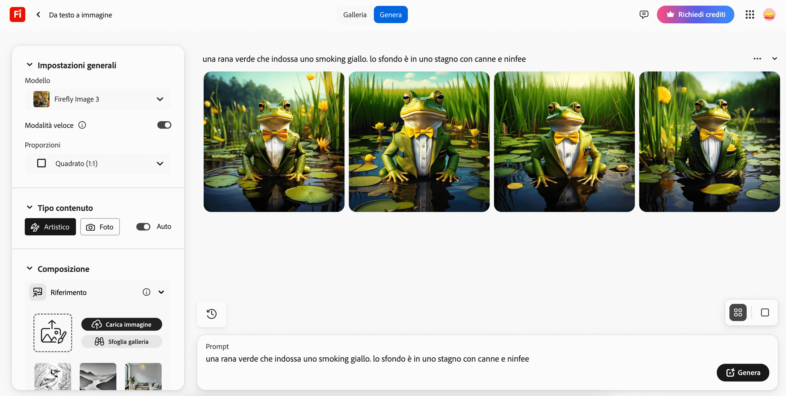

## Cosa creerai

Inserisci una descrizione per un'immagine e osserva come l'intelligenza artificiale trasforma la tua idea in realtà.

Questo progetto utilizza [Adobe Firefly](https://firefly.adobe.com/){:target="_blank"}, che richiede un ID Adobe. Per registrarti, devi avere almeno 13 anni.

## --- collapse ---

## title: Non riesci ad accedere a YouTube? Scarica i video!

Puoi scaricare tutti i video di questo progetto, incluso quello sopra, [cliccando qui](https://rpf.io/p/en/ai-image-go){:target="_blank"}.

\--- /collapse ---