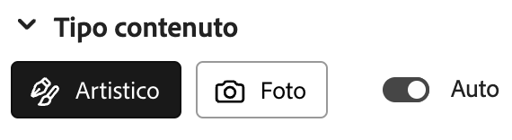
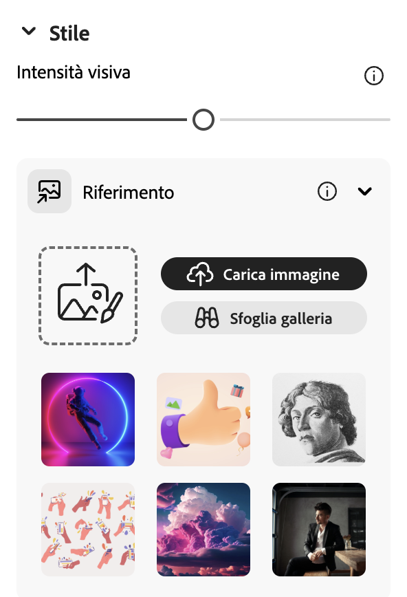
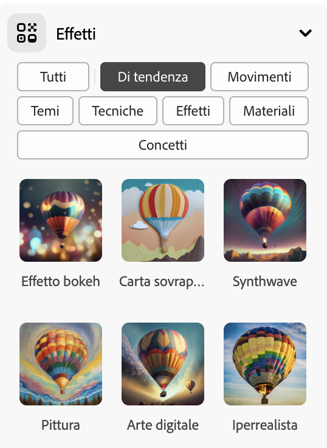
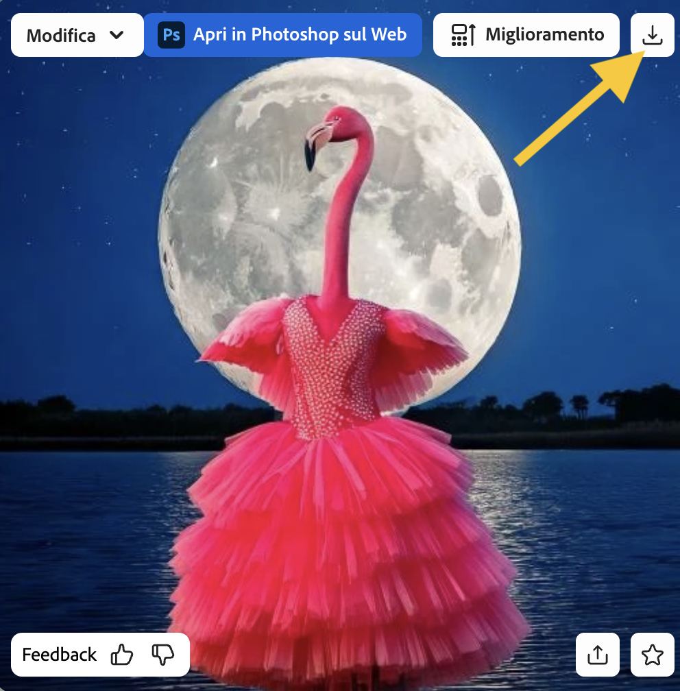

## Stili ed effetti

<html>
  

    <iframe style="position: absolute; top: 0; left: 0; right: 0; width: 100%; height: 100%; border: none;" src="https://www.youtube.com/embed/AXQFcthUIMY?rel=0&cc_load_policy=1" allowfullscreen allow="accelerometer; autoplay; clipboard-write; encrypted-media; gyroscope; picture-in-picture; web-share"></iframe>
  

</html>

Oltre ad aggiungere dettagli al tuo prompt, puoi utilizzare le impostazioni per fornire al modello di intelligenza artificiale ulteriori indicazioni su come desideri che sia l'immagine finale.

### Tipo di contenuto

Seleziona se lo stile dell'immagine deve essere un'illustrazione artistica o una fotografia.

### Stili

Seleziona lo stile dell'immagine che desideri. Puoi anche caricare un'immagine e chiedere al modello di intelligenza artificiale di copiare lo stile.

### Effetti

Seleziona gli effetti che desideri applicare all'immagine. Ad esempio, puoi farla sembrare parte di un fumetto o come se fosse stata disegnata con il carboncino.

\--- task ---

Sperimenta con diversi tipi di contenuti, stili ed effetti finché l'immagine generata dal modello di intelligenza artificiale soddisfa le tue aspettative.

\--- /task ---

\--- task ---

Salva la tua immagine. Cliccaci sopra e poi clicca sul pulsante **Scarica** in alto a destra.

\--- /task ---
