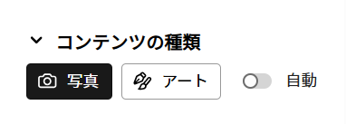
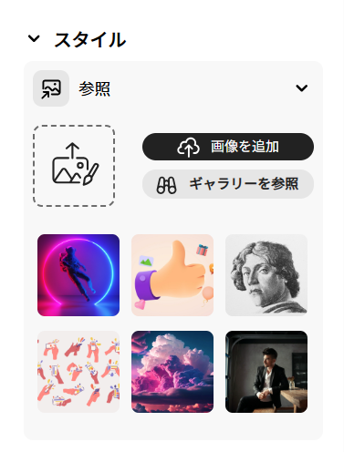
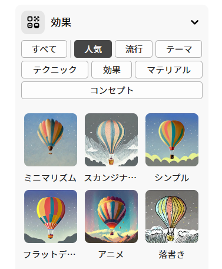
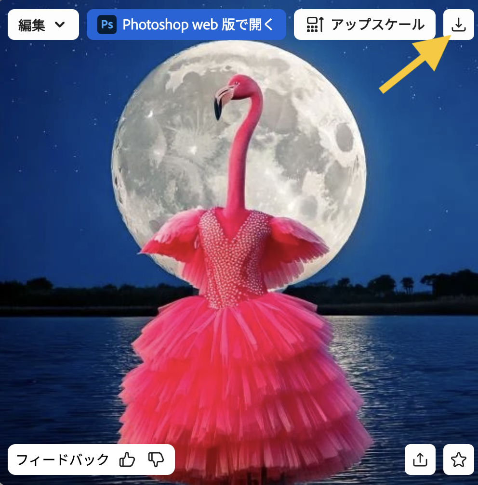

## スタイルと効果

<html>
  

    <iframe style="position: absolute; top: 0; left: 0; right: 0; width: 100%; height: 100%; border: none;" src="https://www.youtube.com/embed/AXQFcthUIMY?rel=0&cc_load_policy=1" allowfullscreen allow="accelerometer; autoplay; clipboard-write; encrypted-media; gyroscope; picture-in-picture; web-share"></iframe>
  

</html>

プロンプトに情報を追加するだけでなく、設定を使用して、完成した画像をどのように見せたいか詳細情報をAIモデルに提供することもできます。

### コンテンツの種類

画像のスタイルがアートか写真かを選択します。

### スタイル

希望する画像のスタイルを選択します。 画像をアップロードして、AIモデルにスタイルをコピーするように指示することもできます。

### 効果

画像に適用したい効果を選択します。 例えば、漫画の一部のように見せたり、炭で描かれたように見せることができます。

\--- task ---

AIモデルが生成する画像に満足するまで、さまざまなコンテンツの種類、スタイル、効果を試してみてください。

\--- /task ---

\--- task ---

画像を保存します。 クリックして、右上の**ダウンロード**ボタンをクリックします。

\--- /task ---
