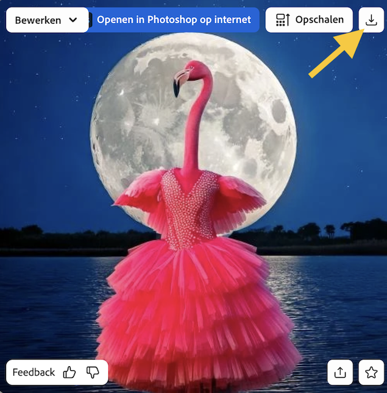

## Stijlen en effecten

<html>
  

    <iframe style="position: absolute; top: 0; left: 0; right: 0; width: 100%; height: 100%; border: none;" src="https://www.youtube.com/embed/AXQFcthUIMY?rel=0&cc_load_policy=1" allowfullscreen allow="accelerometer; autoplay; clipboard-write; encrypted-media; gyroscope; picture-in-picture; web-share"></iframe>
  

</html>

Naast het toevoegen van meer informatie aan je prompt, kan je de instellingen gebruiken om het AI-model meer informatie te geven over hoe jij wilt dat de uiteindelijke afbeelding eruitziet.

### Contenttype

Selecteer of de afbeeldingsstijl kunst of foto is.

### Stijlen

Selecteer de gewenste afbeeldingsstijl. Je kunt zelfs een afbeelding uploaden en het AI-model vragen om de stijl te kopiëren.

### Effecten

Selecteer de effecten die je op jouw afbeelding wilt toepassen. Je kunt het er bijvoorbeeld uit laten zien alsof het uit een stripverhaal komt, of alsof het met houtskool is getekend.

\--- task ---

Experimenteer met verschillende contenttypes, stijlen en effecten totdat je tevreden bent met de afbeelding die het AI-model heeft gegenereerd.

\--- /task ---

\--- task ---

Sla je afbeelding op. Klik erop en klik vervolgens op de knop **Downloaden** rechtsboven.

\--- /task ---
