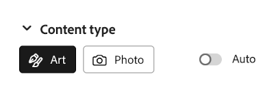
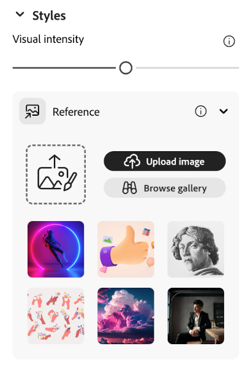
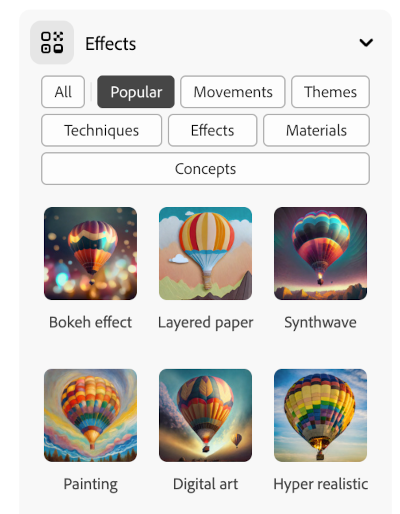

## Estilos e efeitos

<html>
  

    <iframe style="position: absolute; top: 0; left: 0; right: 0; width: 100%; height: 100%; border: none;" src="https://www.youtube.com/embed/AXQFcthUIMY?rel=0&cc_load_policy=1" allowfullscreen allow="accelerometer; autoplay; clipboard-write; encrypted-media; gyroscope; picture-in-picture; web-share"></iframe>
  

</html>

Além de adicionar mais informações ao seu comando, você pode usar as configurações para fornecer ao modelo de IA mais informações sobre como você gostaria que a imagem final fosse.

### Tipo de conteúdo

Selecione se o estilo da imagem é uma obra de arte ou uma fotografia.

### Estilos

Selecione o estilo de imagem que você deseja. Você pode até carregar uma imagem e pedir ao modelo de IA para copiar o estilo.

### Efeitos

Selecione os efeitos que deseja aplicar à sua imagem. Por exemplo, você pode fazer com que pareça parte de uma história em quadrinhos ou que tenha sido desenhada com carvão.

\--- task ---

Experimente diferentes tipos de conteúdo, estilos e efeitos até ficar satisfeito com a imagem que o modelo de IA gerou.

\--- /task ---

\--- task ---

Salve sua imagem. Clique nele e, em seguida, clique no botão **Baixar** no canto superior direito.

![Uma imagem estilizada de um flamingo em uma bola de brinde com uma seta amarela para baixar no canto superior direito da imagem, (images/final-image.png)

\--- /task ---
