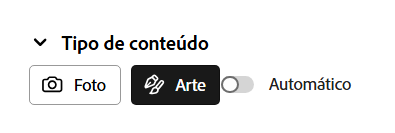
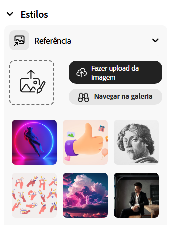
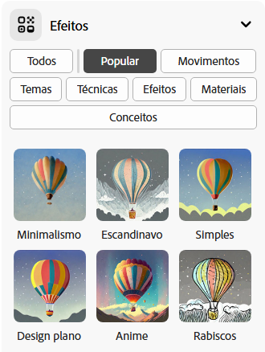

## Estilos e efeitos

<html>
  

    <iframe style="position: absolute; top: 0; left: 0; right: 0; width: 100%; height: 100%; border: none;" src="https://www.youtube.com/embed/AXQFcthUIMY?rel=0&cc_load_policy=1" allowfullscreen allow="accelerometer; autoplay; clipboard-write; encrypted-media; gyroscope; picture-in-picture; web-share"></iframe>
  

</html>

Como também adicionar mais informação ao teu prompt, podes usar as definições para fornecer ao modelo de IA mais detalhes sobre como gostarias que ficasse a tua imagem final.

### Tipo de conteúdo

Escolhe se preferes um estilo de imagem de uma obra de arte ou uma fotografia.

### Estilos

Escolhe o estilo da imagem que queres. Podes até carregar uma imagem e perguntar ao modelo de IA para copiar o estilo.

### Efeitos

Escolhe todos os efeitos que quiseres aplicar na tua imagem. Por exemplo, podes fazer com que pareça parte de um livro de banda desenhada, ou como se tivesse sido desenhado a carvão.

\--- task ---

Experimente diferentes tipos de conteúdo, estilos e efeitos até ficares satisfeito com a imagem gerada pelo modelo de IA.

\--- /task ---

\--- task ---

Salva as tuas imagens. Clica nela e depois clica no botão **Descarregar** no canto superior direito.

\--- /task ---
