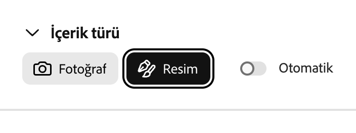
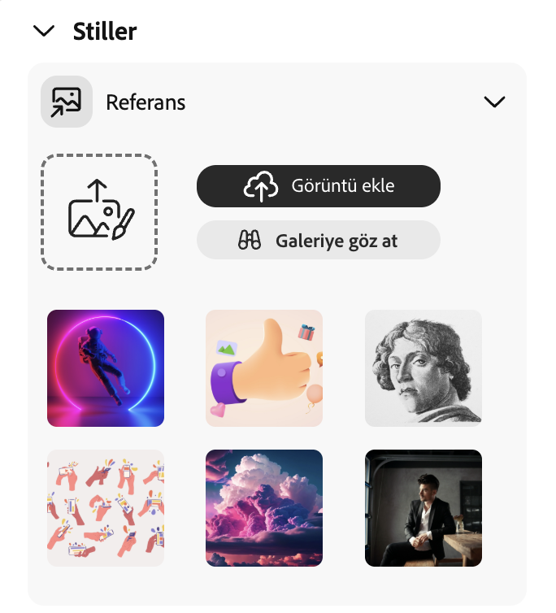
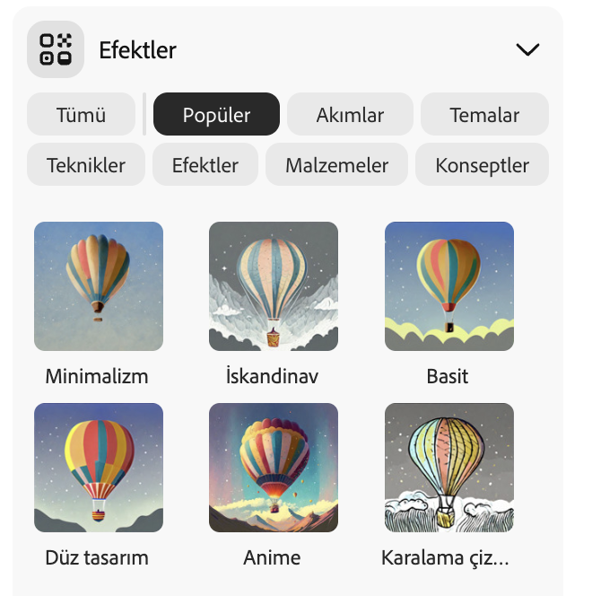
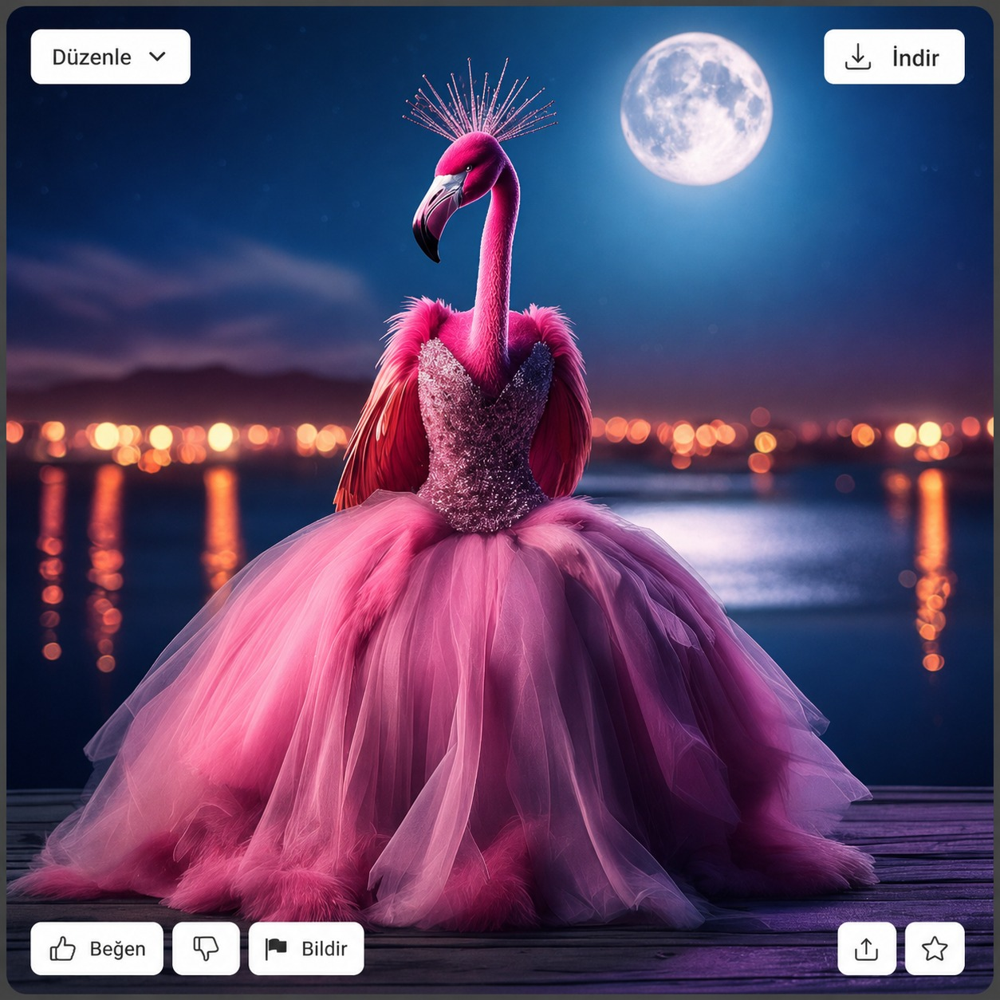

## Stiller ve efektler

<html>
  

    <iframe style="position: absolute; top: 0; left: 0; right: 0; width: 100%; height: 100%; border: none;" src="https://www.youtube.com/embed/AXQFcthUIMY?rel=0&cc_load_policy=1" allowfullscreen allow="accelerometer; autoplay; clipboard-write; encrypted-media; gyroscope; picture-in-picture; web-share"></iframe>
  

</html>

İsteminize daha fazla bilgi eklemenin yanı sıra, ayarları kullanarak yapay zeka modeline bitmiş görüntünün nasıl görünmesini istediğiniz konusunda daha fazla bilgi verebilirsiniz.

### İçerik Türü

Görsel türünün sanat eseri mi yoksa fotoğraf mı olduğunu seçin.

### Stiller

İstediğiniz görsel stilini seçin. Hatta bir resim yükleyip yapay zeka modelinden o stili kopyalamasını bile isteyebilirsiniz.

### Efektler

Resminize uygulamak istediğiniz efektleri seçin. Örneğin, onu bir çizgi romanın parçası gibi gösterebilir ya da kömür kalemle çizilmiş gibi bir görünüm verebilirsiniz.

--- task ---

Yapay zekâ modelinin oluşturduğu görüntüden memnun kalana kadar farklı içerik türleri, stiller ve efektlerle denemeler yapın.

--- /task ---

--- task ---

Resminizi kaydedin. Üzerine tıklayın ve ardından sağ üst köşedeki **İndir** düğmesine tıklayın.

--- /task ---
