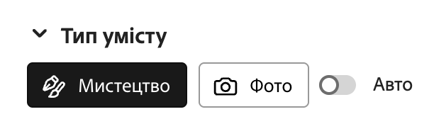
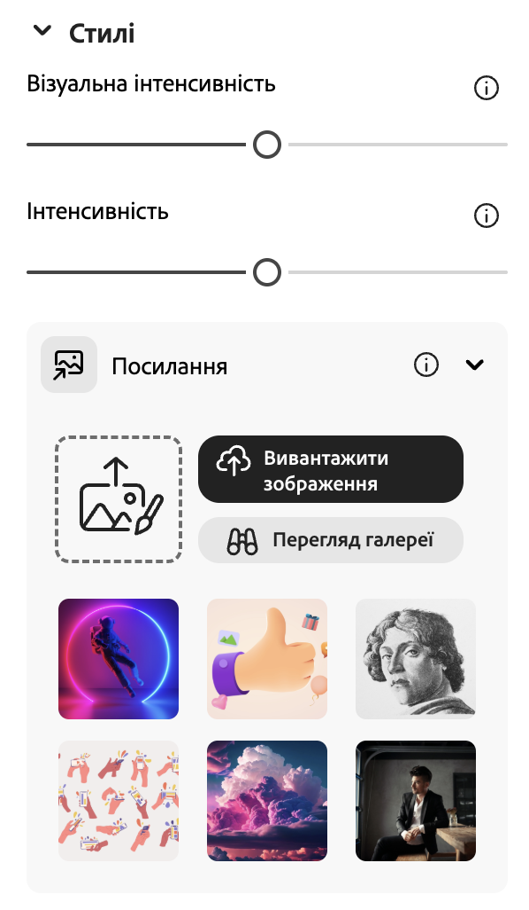
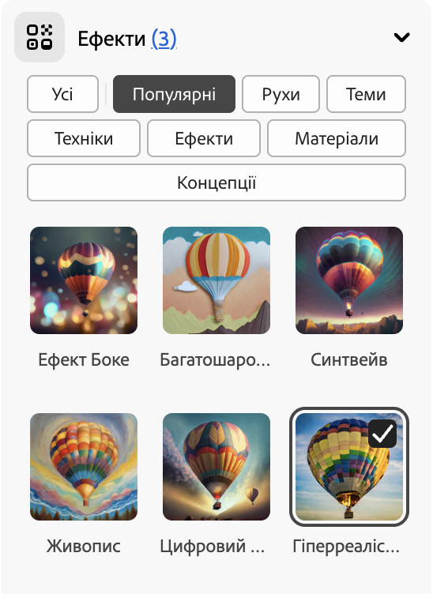
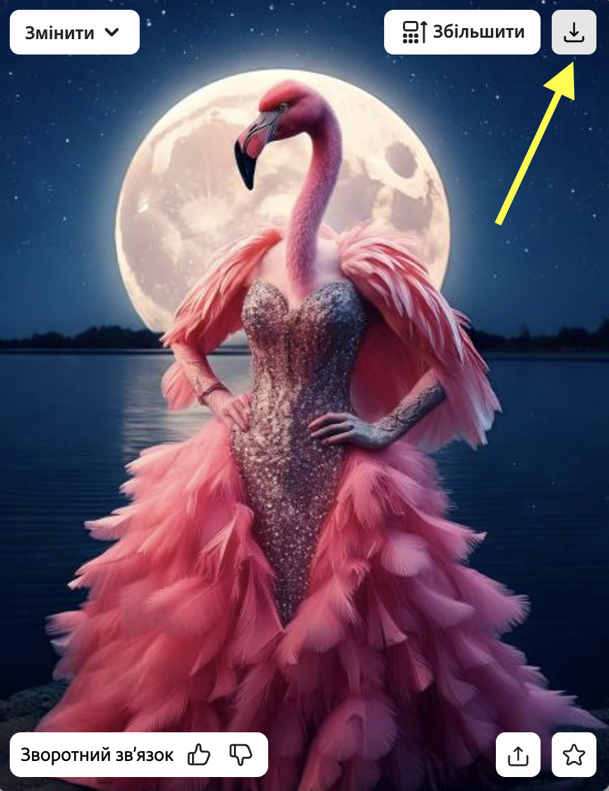

## Стилі й ефекти

<html>
  

    <iframe style="position: absolute; top: 0; left: 0; right: 0; width: 100%; height: 100%; border: none;" src="https://www.youtube.com/embed/AXQFcthUIMY?rel=0&cc_load_policy=1" allowfullscreen allow="accelerometer; autoplay; clipboard-write; encrypted-media; gyroscope; picture-in-picture; web-share"></iframe>
  

</html>

Щоб надати моделі ШІ більше інформації про те, яким ти хочеш бачити фінальне зображення, можна не лише додавати більше деталей до запиту, але й використовувати налаштування.

### Тип умісту
Вибери стиль зображення — картина чи фотографія.

### Стилі
Вибери потрібний стиль зображення. Ти навіть можеш завантажити якесь зображення та попросити модель ШІ скопіювати його стиль.

### Ефекти
Вибери ефекти, які ти хочеш застосувати до свого зображення. Наприклад, ти можеш зробити його схожим на комікс або намальованим чорнилом.

--- task ---

Експериментуй із різними типами вмісту, стилями та ефектами, доки модель ШІ не згенерує бажаний результат.

--- /task ---

--- task ---

Збережи своє зображення. Натисни на нього, а потім на кнопку **Завантажити** у верхньому правому куті.

--- /task ---
